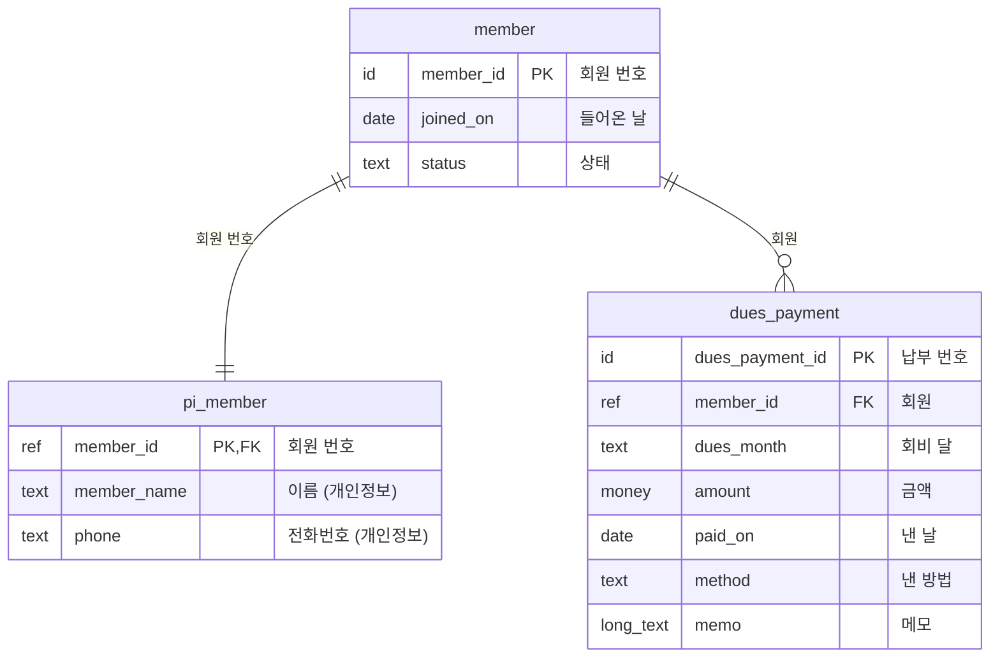

# 동아리 회비 -- ERD

```mermaid
erDiagram
    member {
        id member_id PK "회원 번호"
        date joined_on "들어온 날"
        text status "상태"
    }
    pi_member {
        ref member_id PK,FK "회원 번호"
        text member_name "이름 (개인정보)"
        text phone "전화번호 (개인정보)"
    }
    dues_payment {
        id dues_payment_id PK "납부 번호"
        ref member_id FK "회원"
        text dues_month "회비 달"
        money amount "금액"
        date paid_on "낸 날"
        text method "낸 방법"
        long_text memo "메모"
    }
    member ||--|| pi_member : "회원 번호"
    member ||--o{ dues_payment : "회원"
```
