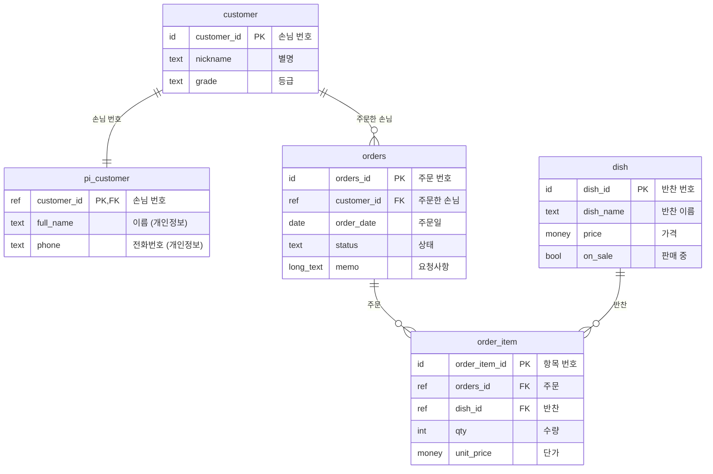

# 반찬가게 주문 -- ERD

```mermaid
erDiagram
    customer {
        id customer_id PK "손님 번호"
        text nickname "별명"
        text grade "등급"
    }
    pi_customer {
        ref customer_id PK,FK "손님 번호"
        text full_name "이름 (개인정보)"
        text phone "전화번호 (개인정보)"
    }
    dish {
        id dish_id PK "반찬 번호"
        text dish_name "반찬 이름"
        money price "가격"
        bool on_sale "판매 중"
    }
    orders {
        id orders_id PK "주문 번호"
        ref customer_id FK "주문한 손님"
        date order_date "주문일"
        text status "상태"
        long_text memo "요청사항"
    }
    order_item {
        id order_item_id PK "항목 번호"
        ref orders_id FK "주문"
        ref dish_id FK "반찬"
        int qty "수량"
        money unit_price "단가"
    }
    customer ||--|| pi_customer : "손님 번호"
    customer ||--o{ orders : "주문한 손님"
    orders ||--o{ order_item : "주문"
    dish ||--o{ order_item : "반찬"
```
